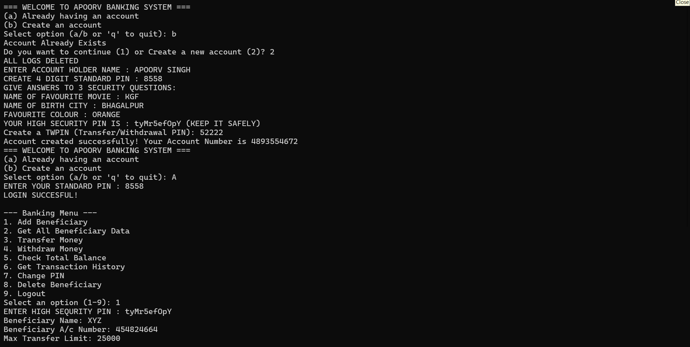

APORV_BANKING_SYSTEM
A feature-rich, command-line Python banking system built with secure file management, multi-layered authentication, and automated transaction logging.

🚀 Overview
Welcome to Apoorv's Banking System!

This is a comprehensive, text-based terminal banking application built in Python. It simulates a secure core banking experience—handling everything from unique account generation and multi-tier security checks to beneficiary management and timestamped transaction history tracking—all stored cleanly across dedicated text files.

✨ Features
🔐 Multi-Tier Security & Authentication:

Standard 4-digit PIN login with a strict 3-attempt limit.

High-Security PIN (HS-PIN) and 3 built-in security questions for account recovery.

Self-Destruct Protocol: Automatically wipes all account and transaction data files if security verification fails completely.

👤 Account Creation & Management:

Automatically generates a random 10-digit account number and a secure numeric High-Security PIN.

Allows standard PIN updates and tracks initial balances.

💳 Core Banking Transactions:

Withdrawals & Transfers: Protected by a separate Transfer/Withdrawal PIN (TPIN) with real-time balance validation.

Balance Inquiry: Instantly check your current account total.

👥 Beneficiary Management:

Add, view, and delete beneficiaries with strict credential validation.

Stored in an isolated text file (data_beneficiary.txt).

📜 Automated Audit Logging:

Automatically records all financial transactions with exact dates and timestamps to data_transaction.enc.

⚙️ Requirements
Python 3.8+ installed on your system
use pip install cryptography for encrypting all files

No external third-party packages required (uses only built-in standard libraries: os, random, string, datetime)
📝 Security Notes
Keep your High-Security PIN (HS-PIN) and TPIN safe; they are required for critical modifications and money transfers.
All data are stored in encrypted format.
Failed security challenges will trigger an automatic wipe of local data files for safety.

📄 License
This project is open-source and available under the MIT License.

👨‍💻 Author
Apoorv Singh

GitHub: apoorvsingh-1503
